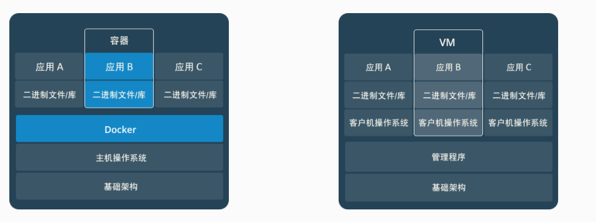
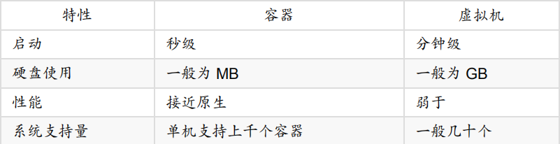
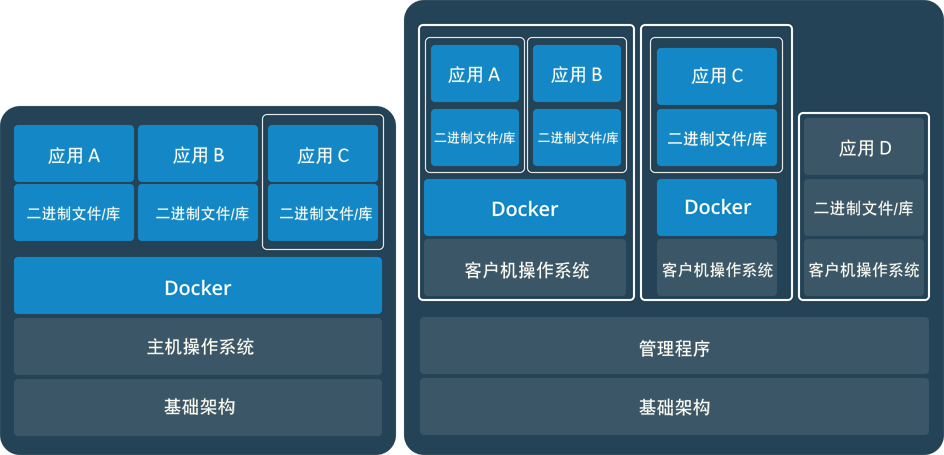

# Docker入门总结

## 一、从“虚拟机”和“容器”说起

### 1.虚拟机

​		虚拟机我们其实都比较熟悉，常用的虚拟机软件有 VMware、VisualBox 等，这些软件需要模拟出包括硬件在内的整台机器，来为每一台虚拟机提供运行环境。

​		**每台虚拟机都需要有自己的操作系统**，虚拟机一旦被开启，预分配给它的资源将全部被占用。每台虚拟机包括应用、必要的二进制和库、以及一个完整的用户操作系统。

### 2.容器

#### 2.1 简介

​		与虚拟机不同，容器技术与我们的宿主机共享硬件资源及操作系统（就相当于操作系统中安装了一个个软件），容器与容器之间**共享内核**，可以实现资源的动态分配。

​		每个容器都包含自己的应用和其所有的依赖包（将运行时环境全部包含在了容器内部，移植后可以直接运行，**相当于Windows下的绿色软件**）。容器在宿主机操作系统中，在用户控件以分离的进程运行。

​		通过下面这幅图，我们可以很直观的反映出容器与虚拟机的区别所在：

#### 2.2 通过一个例子更直观的了解容器

​		假如我们在开发一个应用，使用的是一台笔记本电脑，并且开发环境具有特定的配置，与其他开发人员的环境配置可能稍有不同，而我们正在开发的应用又依赖于这台笔记本电脑的特定配置，还要依赖于某些特定文件。与此同时，公司还拥有标准化的测试和生产环境，且具有自身的配置和一系列支持文件。

​		所以，我们现在面临的问题是：如何确保应用能够在其他环境中运行和通过质量检测，并且在部署过程中不出现令人头疼的问题，也无需重新编写代码和进行故障修复？答案就是使用容器。

​		我们可以通过容器技术确保我们的应用拥有必需的配置和文件，使得这些应用能够在从开发到测试、再到生产的整个流程中顺利运行，而不出现任何不良问题。

#### 2.3 容器的作用

- 通过使用容器，我们可以轻松打包应用程序的代码、配置和依赖关系，将其变成容易使用的构建块，从而实现环境一致性、运营效率、开发人员生产力和版本控制等诸多目标。
- 容器可以帮助保证应用程序快速、可靠、一致地部署，其间不受部署环境的影响。
- 容器还赋予我们对资源更多的精细化控制能力，让我们的基础设施效率更高。

### 3.容器与虚拟机对比

### 4.容器与虚拟机可共存

## 二、Docker简介

### 1.Docker的前生LXC（Linux容器）

​		LXC 为 Linux Container 的简写，即 Linux容器，**是一种轻量级的虚拟化的手段**。

​		LXC 可以提供轻量级的虚拟化，以便隔离进程和资源，而且不需要提供指令解释机制以及全虚拟化的其他复杂性，相当于C++中的NameSpace。容器**有效地将由单个操作系统管理的资源划分到孤立的组中**，以更好地在孤立的组之间平衡有冲突的资源使用需求。

​		Linux Container提供了在单一可控主机节点上支持多个相互隔离的server container同时执行的机制。Linux Container有点像chroot，提供了一个拥有自己进程和网络空间的虚拟环境，但又**有别于虚拟机**，因为**LXC是一种操作系统层次上的资源的虚拟化**。

### 2.什么是Docker

​		Docker是一个**开源的应用容器引擎**，基于go语言开发并遵循了apache2.0 协议开源。

​		Docker 属于 Linux 容器的一种封装，**提供简单易用的容器使用接口**，是目前**最流行的 Linux 容器解决方案**。但 Docker 并**不是 LXC 的替代品**，Docker 底层使用了 LXC 来实现，LXC 将 linux 进程**沙盒化**，使得进程之间相互隔离，并且能够控制各进程的资源分配。在 LXC 的基础上，Docker 提供了一系列更强大的功能。

​		Docker 将应用程序与该程序的依赖，**打包在一个文件里面**。运行这个文件，就会生成一个**虚拟容器**。程序在这个虚拟容器里运行，就好像在真实的物理机上运行一样。有了 Docker ，就不用担心环境问题了，可以将我们的应用程序发布到任何流行的Linux服务器，也可以实现虚拟化。

​		总体来说，Docker 的接口相当简单，用户可以**方便地创建和使用容器**，**把自己的应用放入容器**。容器还可以进行版本管理、复制、分享、修改，就像管理普通的代码一样。

### 3.Docker的优缺点

#### 3.1 优点

- Docker **启动快速**属于秒级别，而虚拟机通常需要几分钟去启动。
- Docker **需要的资源更少**。Docker 在操作系统级别进行虚拟化，与宿主机使用同一个内核，且 Docker 容器和内核交互几乎没有性能损耗，性能优于通过 Hypervisor 层与内核层的虚拟化。
- Docker **更轻量**。Docker 的架构可以共用一个内核与共享应用程序库，所占内存极小。同样的硬件环境，Docker 运行的镜像数远多于虚拟机数量，对系统的利用率非常高。

- Docker 具有**快速迭代性**。这一特性使得无论是开发、测试、部署都可以节约大量时间。

- Docker 可实现**快速分发和快速部署**。虚拟机可以通过镜像实现环境交付的一致性，但镜像分发无法体系化。Docker 在 Dockerfile 中记录了容器构建过程，可在集群中实现快速分发和快速部署。

#### 3.2 缺点

- 与虚拟机相比，Docker **隔离性更弱**。Docker 属于进程之间的隔离，虚拟机可实现系统级别隔离。
- 与虚拟机相比，Docker **安全性更弱**。Docker 的租户 Root 和宿主机 Root 等同，一旦容器内的用户从普通用户权限提升为 Root 权限，它就直接具备了宿主机的 Root 权限，进而可进行无限制的操作。而虚拟机租户的 Root 权限和宿主机的 Root 虚拟机权限是分离的，并且虚拟机利用如 Intel 的 VT-d 和 VT-x 的 ring-1 硬件隔离技术。这种隔离技术可以防止虚拟机突破和彼此交互，而容器至今还没有任何形式的硬件隔离，这使得容器**容易受到攻击**。
- Docker 的集中化管理工具还不算成熟，**可管理性不高**。各种虚拟化技术都有成熟的管理工具，例如 VMware 、vCenter 提供完备的虚拟机管理能力。

### 4.Docker的三个基本概念

- 从上图我们可以看到，Docker 中包括三个基本的概念：
  - **Image**（镜像）
  - **Container**（容器）
  - **Repository**（仓库）

- 其中，**镜像是 Docker 运行容器的前提**，**仓库是存放镜像的场所**，可见**镜像更是 Docker 的核心**。
- 下面对这三个概念进行依次介绍。

#### 4.1 Image（镜像）

​		Docker 镜像可以看作是一个特殊的文件系统，除了提供容器运行时所需的程序、库、资源、配置等文件外，还包含了一些为运行时准备的一些配置参数（如匿名卷、环境变量、用户等）。

​		镜像不包含任何动态数据，其内容在构建之后也不会被改变。**镜像（Image）就是一堆只读层（read-only layer）的统一视角**，也许这个定义有些难以理解，下面的这张图能够帮助我们理解镜像的定义：

​		从左边我们看到了多个只读层，它们重叠在一起。除了最下面一层，其他层都会有一个指针指向下一层（单链表）。这些层是 Docker 内部的实现细节，并且能够在主机的文件系统上访问到。

​		**统一文件系统（UnionFS，Union File System）技术**能够将不同的层整合成一个文件系统，为这些层提供了一个统一的视角。这样就隐藏了多层的存在，在用户的角度看来，只存在一个文件系统。我们可以在图片的右边看到这个视角的形式。

#### 4.2 Container（容器）

​		容器（Container）的定义和镜像（Image）几乎一模一样，也是一堆层的统一视角，唯一区别在于容器的**最上面那一层是可读可写的**，所以实际上，**容器 = 镜像 + 读写层**。如下图所示：

​		容器与镜像的区别如下：

- **容器是由镜像实例化而来的**，这和我们学习的面向对象的概念十分相似，我们可以把镜像看作类，把容器看作类实例化后的对象。
- 也可以说**镜像是文件，容器是进程**。容器是基于镜像创建的，即容器中的进程依赖于镜像中的文件，这里的文件包括进程运行所需要的可执行文件， 依赖软件， 库文件， 配置文件等等。
- **Docker 利用容器来运行应用**：**Docker 容器是由 Docker 镜像创建的运行实例**。容器可以理解为一个轻量级的沙箱，Docker 利用容器来运行和隔离应用，**容器是可以被启动、停止、删除的**，这并**不会影响 Docker 镜像**。也可以把容器看作一个简易版的 Linux 环境（包含root用户权限，进程空间，用户空间和网络空间等）和运行在其中的应用程序。
- 相对于镜像来说**容器是动态的**，容器在启动的时候创建了一层可写层次作为最上层。（ docker create <image -id > ：为指定的镜像添加一个可读写层，构成一个新的容器）

#### 4.3 Repository（仓库）

##### 4.3.1 仓库的作用

​		Docker 仓库是集中存放镜像文件的场所。

​		镜像构建完成后，可以很容易的在当前宿主机上运行。但是， 如果需要在其他服务器上使用这个镜像，我们就需要一个**集中的存储、分发镜像的服务**，**Docker Registry（仓库注册服务器）**就是这样的服务。

​		有时候会把仓库（Repository）和仓库注册服务器（Registry）混为一谈，并不严格区分。Docker 仓库的概念跟 Git 类似，注册服务器可以理解为 GitHub 这样的托管服务。实际上，**一个 Docker Registry 中可以包含多个仓库（Repository）**，**每个仓库可以包含多个标签（Tag）**，**每个标签对应着一个镜像**。

​		所以说，镜像仓库是 Docker 用来集中存放镜像文件的地方，类似于我们之前常用的代码仓库。通常，**一个仓库会包含同一个软件不同版本的镜像**，而**标签就常用于对应该软件的各个版本** 。我们可以通过**<仓库名>:<标签>**的格式来指定具体是这个软件哪个版本的镜像。如果不给出标签，将以 Latest 作为默认标签。

##### 4.3.2 仓库的两种形式

- **Public（公有仓库）**
  - Docker Registry 公有仓库是开放给用户使用、允许用户管理镜像的 Registry 服务。
  - 一般这类公开服务允许用户免费上传、下载公开的镜像，并可能提供收费服务供用户管理私有镜像。
- **Private（私有仓库）**
  - 除了使用公开服务外，用户还可以在本地搭建私有 Docker Registry。
  - Docker 官方提供了 Docker Registry 镜像，可以直接使用做为私有 Registry 服务。
- 使用
  - 当用户创建了自己的镜像之后就可以使用 Push 命令将它上传到公有或者私有仓库；
  - 这样下次在另外一台机器上使用这个镜像的时候，只需要从仓库上 Pull 下来就可以了。

## 三、参考链接

- [Docker官方文档](https://docs.docker.com/)
- [认识容器](https://snailclimb.gitee.io/javaguide/#/docs/tools/Docker?id=%e5%85%ad-build-ship-and-run)
- [Docker入门总结](http://dockone.io/article/8350)
- [Docker 架构原理及简单使用](https://www.cnblogs.com/zhangxingeng/p/11236968.html)
- [关于Docker容器和镜像的区别](https://www.cnblogs.com/baizhanshi/p/9655102.html)

