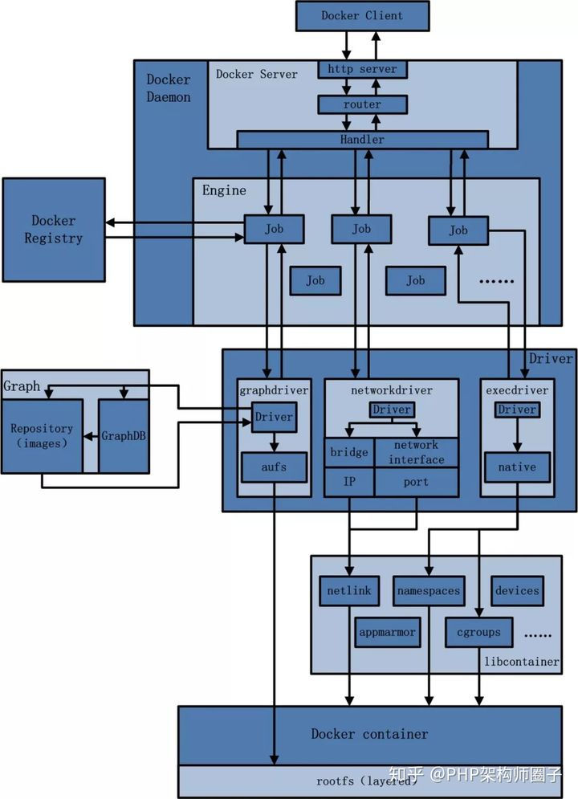
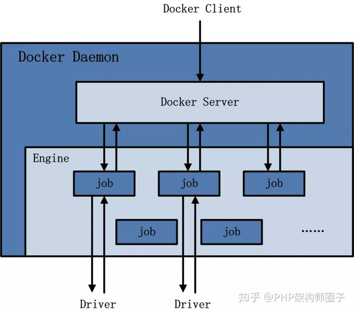
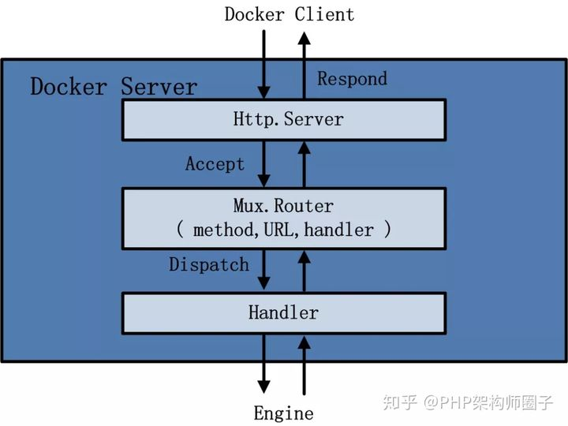
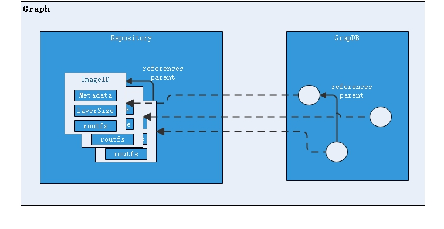
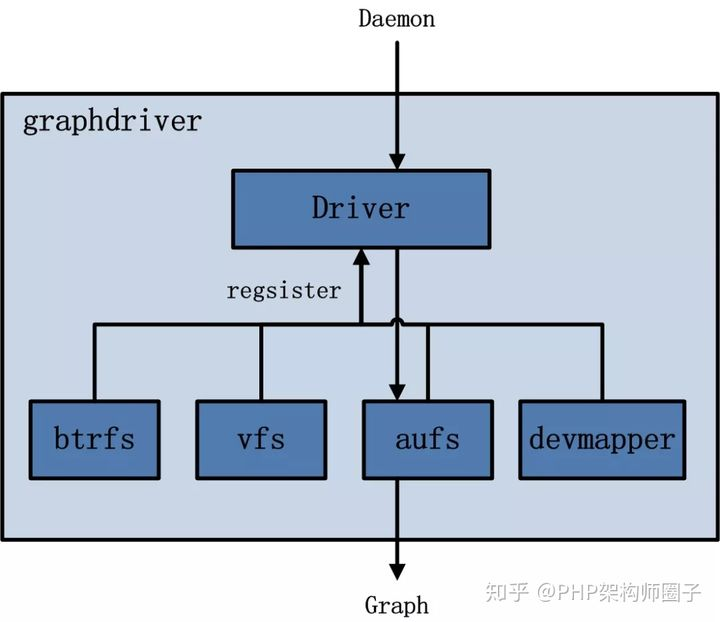
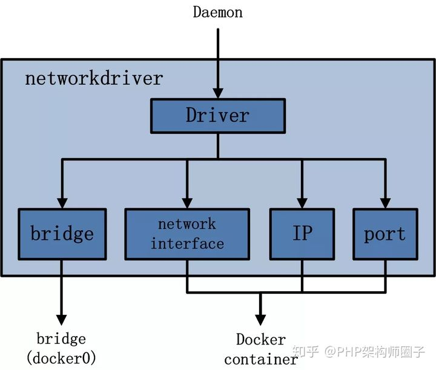
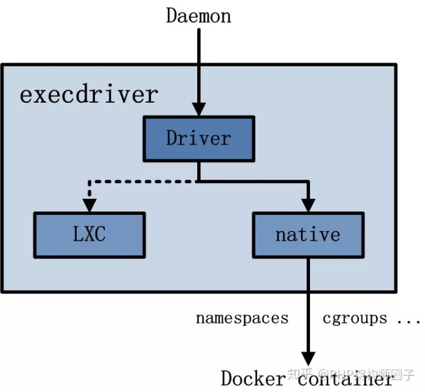
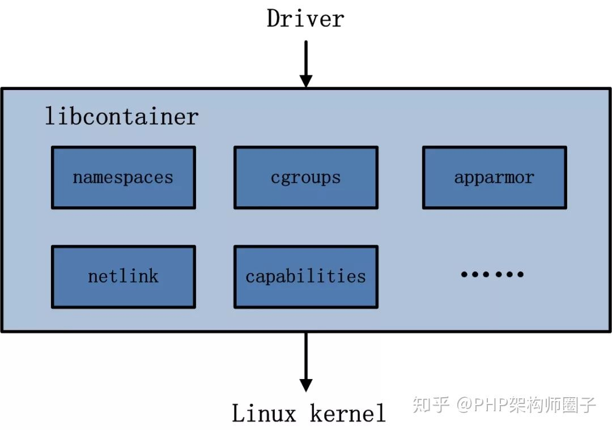
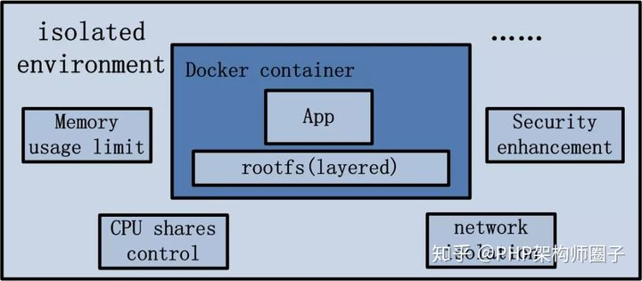

# Docker架构

## 一、Docker 的总体架构

Docker 是一个 **C/S（Client/Server）** 模式的架构，后端是一个松耦合架构，模块各司其职，总体架构图如下：

- 用户使用 **Docker Client** 与 **Docker Daemon** 建立通信，并发送请求给后者。
- Docker Daemon 作为 Docker 架构中的主体部分，首先提供 **Docker Server** 的功能使其可以接受 Docker Client 的请求。
- **Engine** 执行 Docker 内部的一系列工作，每一项工作都是以一个 **Job** 的形式存在。
- Job 的运行过程中：
  - 当需要容器镜像时，则从 **Docker Registry** 中下载镜像，并通过**镜像管理驱动 graphdriver** 将下载镜像以 **Graph** 的形式存储。
  - 当需要为 Docker 创建网络环境时，通过**网络管理驱动 networkdriver** 创建并配置 Docker 容器网络环境。
  - 当需要限制 Docker 容器运行资源或执行用户指令等操作时，则通过 **execdriver** 来完成。
- **Libcontainer** 是一项独立的容器管理包，Networkdriver 以及 Execdriver 都是通过 Libcontainer 来实现具体的对容器进行的操作的。
- **Docker container**（Docker容器）是 Docker 架构中服务交付的最终体现形式。

## 二、Docker 各模块组件分析

### 1.Docker Client「发起请求」

- Docker Client **是和 Docker Daemon 建立通信的客户端**，**是负责和用户交互的 CLI**（command line Interface）。用户使用的可执行文件为 docker（一个命令行可执行文件），docker 命令使用**后接参数的形式**来实现一个完整的请求命令（例如：docker images，docker 为命令不可变，images 为参数可变）。
- Docker Client 可以通过以下三种方式和 Docker Daemon 建立通信：
  - tcp://host:port
  - unix://pathtosocket
  - fd://socketfd
- Docker Client 发送容器管理请求后，由 Docker Daemon 接受并处理请求，当 Docker Client 接收到返回的请求响应并简单处理后，Docker Client 一次完整的生命周期就结束了（一次完整的请求：发送请求→处理请求→返回结果），与传统的 C/S 架构请求流程并无不同。

### 2.Docker Daemon「后台守护进程」

#### 2.1 Docker Daemon 架构图

- Docker Daemon 是 Docker 架构中一个常驻在后台的系统进程（守护进程），功能是**接收处理 Docker Client 发送的请求**。
- Docker Daemon 启动所使用的可执行文件也为 docker，与 Docker Client 启动所使用的可执行文件 docker 相同，在 docker 命令执行时，通过传入的参数来判别 Docker Daemon 与 Docker Client 。
- **Docker Daemon 的架构分为：Docker Server、Engine、Job** 三部分。

#### 2.2 Docker Server 

​		Docker Server 在 Docker 架构中是专门服务于 Docker Client 的 server，该 server 的功能是：**接收并调度分发 Docker Client 发送的请求，并找到相应的 Handler 来执行请求**，架构图如下：

- 在 Docker 的启动过程中，通过包 gorilla/mux 创建了一个 mux.Router 来提供请求的路由功能。在 Golang 中 gorilla/mux 是一个强大的 URL 路由器以及调度分发器。该 mux.Router 中添加了众多的路由项，每一个路由项由 HTTP 请求方法 method（PUT、POST、GET 或 DELETE）、URL、handler 三部分组成。
- 创建完 mux.Router 之后，Docker 将 Server 的监听地址以及 mux.Router 作为参数来创建一个 httpSrv=http.Server{}，最终执行 httpSrv.Serve() 为请求服务。
- 在 Docker Server 的服务过程中，Docker Server 在 listener 上接受 Docker Client 的访问请求，并创建一个全新的 goroutine 来服务该请求。在 goroutine 中，首先读取请求内容并做解析工作，接着找到相应的路由项并调用相应的 Handler 来处理该请求，最后 Handler 处理完请求之后回复该请求。
- 需要注意的是：Docker Server 的运行在 Docker 的启动过程中，是靠一个名为 **“serveapi”** 的 job 的运行来完成的。原则上，Docker Server 的运行是众多 job 中的一个，但是为了强调 Docker Server 的重要性以及为后续 job 服务的重要特性，将该 ”serveapi” 的 job 单独抽离出来分析，理解为 Docker Server。

#### 2.3 Engine

- Engine 是 Docker 架构中的运行引擎，同时也是 **Docker 运行的核心模块**。它**扮演 Docker Container 存储仓库的角色**，并且通过执行 Job 的方式来操纵管理这些容器。
- 在 Engine 数据结构的设计与实现过程中，有一个 Handler 对象（即 Docker Server 中的 Handler）。该 Handler 对象存储的都是关于众多特定 Job 的 Handler 处理访问。举例说明：Engine 的 Handler 对象中有一项为：{“create”: daemon.ContainerCreate,}，这说明当名为”create” 的 Job 在运行时，执行的是名为 daemon.ContainerCreate 的 Handler。

#### 2.4 Job

- 一个 Job 可以认为是 Docker 架构中 Engine 内部最基本的工作执行单元。
- Docker 可以做的每一项工作，都可以抽象为一个job。例如：
  - 在容器内部运行一个进程，这是一个job；
  - 创建一个新的容器，这是一个job；
  - 从 Internet 上下载一个文档，这是一个job；
  - 包括之前在 Docker Server 部分说过的，创建 Server 服务于 HTTP 的 API，这也是一个job，等等。
- Job 的设计者，把 Job 设计得与 Unix 进程相仿。比如说：Job 有一个名称，有参数，有环境变量，有标准的输入输出，有错误处理，有返回状态等。

### 3.Docker Registry「镜像注册中心」

- Docker Registry 是一个存储容器镜像的仓库（注册中心），可理解为**云端镜像仓库**。按 Repository 来分类，docker pull 按照 [repository]:[tag] 来精确定义一个具体的 Image。
- 在 Docker 的运行过程中，Docker Daemon 会与 Docker Registry 通信，并实现**搜索镜像、下载镜像、上传镜像**三个功能，这三个功能对应的 Job 名称分别为： **“search”、”pull” 与 “push”**。
- 在Docker架构中，Docker Registry 可分为**公有仓库**和**私有仓库**。
  - 公有仓库即大家熟知的 **Docker Hub**，这样 Docker 在获取容器镜像文件时，必须通过互联网访问 Docker Hub 才可完成；
  - Docker 也允许用户构建本地私有的 Docker Registry，这样可以保证容器镜像的获取在内网完成。

### 4.Graph「Docker 内部数据库」

#### 4.1 Graph 架构图

- Graph 在 Docker 架构中**扮演已下载容器镜像的保管者，以及已下载容器镜像之间关系的记录者**。
- 一方面，Graph 存储着本地具有版本信息的文件系统镜像；
- 另一方面也通过 GraphDB 记录着所有文件系统镜像彼此之间的关系。

#### 4.2 Repository

- Repository 是已下载镜像的保管者（包括下载的镜像和通过 Dockerfile 构建的镜像）。
- 一个 Repository 表示某类镜像的仓库（例如：Ubuntu），同一个 Repository 内的镜像用 Tag 来区分（表示同一类镜像的不同标签或版本）。一个 Registry 包含多个 Repository，一个 Repository 包含同类型的多个 Image（Tag）。
- 在 Graph 的本地目录中存储着有关于每一个容器镜像的具体信息，包含有：该容器镜像的元数据、该容器镜像的大小信息、以及该容器镜像所代表的具体 rootfs 等。

#### 4.3 GraphDB

- GraphDB 是已下载容器镜像之间关系的记录者。
- GraphDB 是一个构建在 **SQLite** 之上的小型数据库，实现了节点的命名以及节点之间关联关系的记录。
- 它仅仅实现了大多数图数据库所拥有的一个小的子集，但是提供了简单的接口表示节点之间的关系。

### 5.Driver「 Docker 容器管理」

#### 5.1 Driver 作用

- Driver 是 Docker 架构中的驱动模块。通过 Driver 驱动，Docker 可以**实现对 Docker 容器执行环境的定制**。
- 由于 Docker 运行的生命周期中，并非用户所有的操作都是针对 Docker 容器的管理，另外还有关于 Docker 运行信息的获取、Graph 的存储与记录等。因此，**为了将 Docker 容器的管理从 Docker Daemon 内部业务逻辑中区分开来**，设计了 Driver 驱动层来接管所有这部分请求（**专门处理 Docker 容器的管理工作**）。
- 在 Docker Driver 的实现中，主要分为以下三类驱动：**graphdriver**、**networkdriver** 和 **execdriver**。

#### 5.2 graphdriver

- graphdriver 架构图

- graphdriver 主要用于**完成容器镜像的管理**，包括存储与获取：
  - **存储**：docker pull 下载的镜像由 graphdriver 存储到本地的指定目录（Graph 中 ）。
  - **获取**：docker run（create）用镜像来创建容器的时候，由 graphdriver 到本地 Graph 中获取镜像。

- 在 graphdriver 的初始化过程之前，有**4种文件系统或类文件系统**在其内部注册，它们分别是 **btrfs**、**vfs**、**aufs** 和 **devmapper**，如 graphdriver 架构图中所示。
- 而 Docker 在初始化之时，通过获取系统环境变量”**DOCKER_DRIVER**”来提取所使用 Driver 的指定类型（文件系统类型），并且之后所有的 Graph 操作，都使用该 Driver 来执行。

#### 5.3 networkdriver

- networkdriver 架构图

- Networkdriver 的用途是**完成 Docker 容器网络环境的配置**，其中包括：
  - Docker 启动时为 Docker 环境创建网桥。
  - Docker 容器创建时为其创建专属虚拟网卡设备。
  - Docker 容器分配IP、端口并与宿主机做端口映射，设置容器防火墙策略等。

#### 5.4 execdriver

- execdriver 架构图

- execdriver 作为 **Docker 容器的执行驱动**，主要负责以下内容：
  - 创建容器运行命名空间；
  - 容器资源使用的统计与限制；
  - 容器内部进程的真正运行等。

- 现在 execdriver 默认使用 **Native 驱动**，不依赖于 LXC（Docker实现跨平台的一个先兆）。

### 6.libcontainer「函数库」

- libcontainer 架构：

- libcontainer 是 Docker 架构中一个**使用 Go 语言设计实现的库**，设计**初衷是希望该库可以不依靠任何依赖，直接访问内核中与容器相关的API**。
- 正是由于 libcontainer 的存在，使得 Docker 可以直接调用 libcontainer 来操纵容器的 namespace、cgroups、apparmor、网络设备以及防火墙规则等。这一系列操作的完成都**不需要依赖 LXC 或者其他包**。
- libcontainer **提供了一整套标准的接口**来满足上层对容器管理的需求。或者说，**libcontainer 屏蔽了 Docker 上层对容器的直接管理**。

### 7.Docker Container「服务交付的最终形式」

- Docker Container 架构：

- Docker Container（ Docker 容器 ）**是 Docker 架构中服务交付的最终体现形式**。
- Docker 按照用户的需求与指令，**订制相应的 Docker 容器**：
  - 用户通过指定容器镜像，使得 Docker 容器可以自定义 rootfs 等文件系统。
  - 用户通过指定计算资源的配额，使得 Docker 容器使用指定的计算资源。
  - 用户通过配置网络及其安全策略，使得 Docker 容器拥有独立且安全的网络环境。
  - 用户通过指定运行的命令，使得 Docker 容器执行指定的工作。

## 三、参考链接

- [Docker官方文档](https://docs.docker.com/)
- [图解Docker架构](https://zhuanlan.zhihu.com/p/92958486)
- [Docker 架构原理及简单使用](https://www.cnblogs.com/zhangxingeng/p/11236968.html)

