# Docker的安装与简单使用

## 前言

- 从 2017 年 3 月开始（17.03版本）， docker 在原来的基础上分为两个分支版本：
  - **Docker CE（Community Edition）** 即社区免费版，可满足个人使用需求；
  - **Docker EE（Enterprise Edition）** 即企业版，强调安全，但需付费使用。
- 本文主要介绍 **Docker CE** 在 **Ubuntu** 中的安装使用。


## 一、Ubuntu下 Docker CE 安装步骤

### 1.换源

- 我们需要先把 Ubuntu 的源修改为清华大学的源，下面示例中的源亲测可用，推荐使用。
- 使用方法：使用下面内容替换 **/etc/apt/sources.list** 文件内容即可（可以先做个备份）。

```
# 清华源（ubuntu 20.04）
deb https://mirrors.tuna.tsinghua.edu.cn/ubuntu/ xenial main restricted universe multiverse
# deb-src https://mirrors.tuna.tsinghua.edu.cn/ubuntu/ xenial main restricted universe multiverse
deb https://mirrors.tuna.tsinghua.edu.cn/ubuntu/ xenial-updates main restricted universe multiverse
# deb-src https://mirrors.tuna.tsinghua.edu.cn/ubuntu/ xenial-updates main restricted universe multiverse
deb https://mirrors.tuna.tsinghua.edu.cn/ubuntu/ xenial-backports main restricted universe multiverse
# deb-src https://mirrors.tuna.tsinghua.edu.cn/ubuntu/ xenial-backports main restricted universe multiverse
deb https://mirrors.tuna.tsinghua.edu.cn/ubuntu/ xenial-security main restricted universe multiverse
# deb-src https://mirrors.tuna.tsinghua.edu.cn/ubuntu/ xenial-security main restricted universe multiverse
```


### 2.卸载旧版本 docker

```
sudo apt-get remove docker docker-engine docker.io containerd runc
```


### 3.仓库设置（Set up the repository）

#### 3.1 更新 Ubuntu 的 apt 源索引

```
sudo apt-get update
```

#### 3.2 安装依赖

```
sudo apt-get install \
	apt-transport-https ca-certificates curl gnupg2 software-properties-common
```

#### 3.3 添加 Docker 官方 GPG key

```
curl -fsSL https://download.docker.com/linux/ubuntu/gpg | sudo apt-key add -

注：若提示‘curl’指令找不到，则需要先执行“sudo snap install curl”进行安装，然后再执行以上指令。
```

#### 3.4 设置 Docker 稳定版仓库

- 先通过 **arch** 指令查看当前系统架构，然后选择相应指令，本机为 x86_64 ；
- 这里设置下载仓库路径为清华大学源，以提高下载速度；

```
sudo add-apt-repository \
    "deb [arch=amd64] https://mirrors.tuna.tsinghua.edu.cn/docker-ce/linux/ubuntu \
    $(lsb_release -cs) \
    stable"
```


### 4.安装 Docker Engine

#### 4.1 添加仓库后，更新 apt 源索引

```
sudo apt-get update
```

#### 4.2 安装最新版 Docker CE

```
sudo apt-get install docker-ce
```


### 5.安装成功

- #### 成功执行以下命令后，说明 Docker 安装成功
  - #### docker -v

  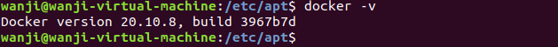

  - #### sudo docker version

  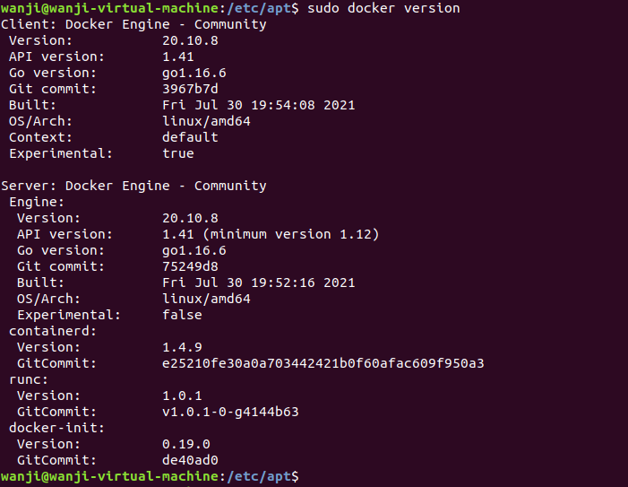


### 6.权限配置

- 为了避免每次执行 docker 命令都需要输入sudo，需要**设置非 root 用户权限**

```
sudo usermod -a -G docker [USER]
```

- 注意：指令执行后须**重启系统**


## 二、Docker 的简单运用：hello-world

### 1.镜像搜索（search）

```
docker search [IMAGE-NAME / KEY-WORD]
```

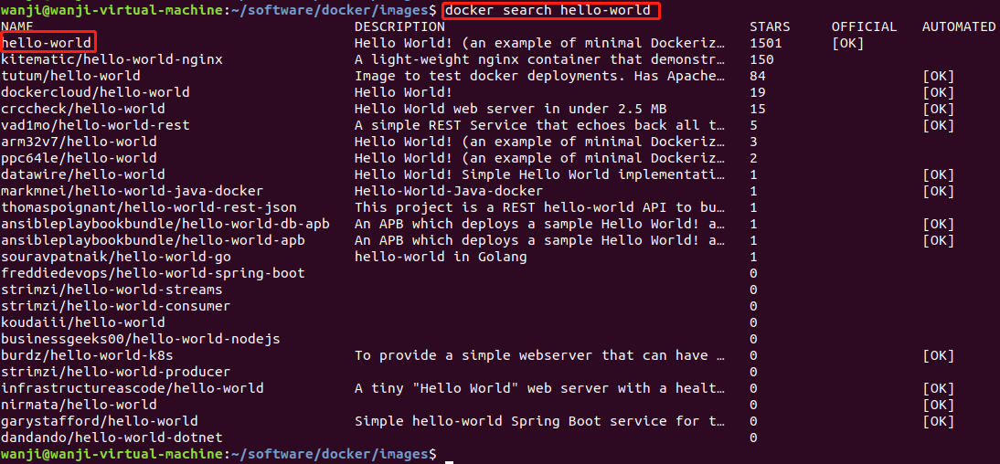


### 2.从仓库拉取镜像到本地（pull）

```
docker pull hello-world
```

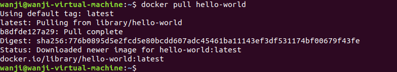


### 3.查看本地已经下载的镜像（images）

```
docker images
```

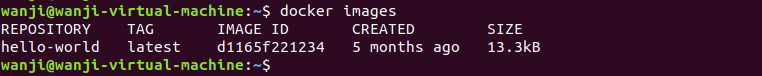


### 4.运行拉取的镜像（run）

```
docker run [IMAGE]
```

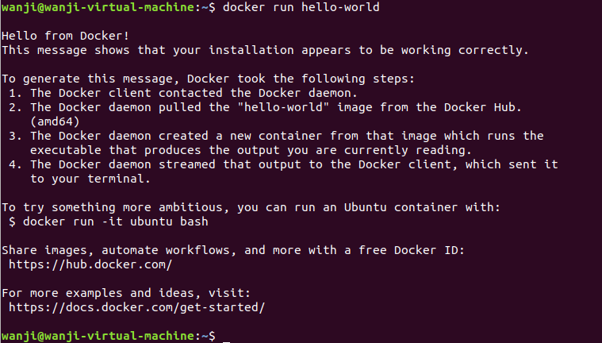

- 也可以在 run 指令后面添加参数：

  - 示例：docker run -dit test/myubuntu:v1.0 /bin/bash
  - -i  ：交互式操作，即返回命令执行结果；
  - -t  ：开启伪终端；
  - -d  ：容器启动后进入后台，不会把输出结果 (STDOUT) 打印到宿主机上，此时若想进入终端，需要另外执行进入容器的指令；
  - --rm  ：默认情况下，容器退出后并不会自动删除，而这个参数是让容器退出后随之将其删除。
  - /bin/bash  ：这条指令放于镜像名后面，意思是希望有个交互式 shell。
  - 示例如下：

  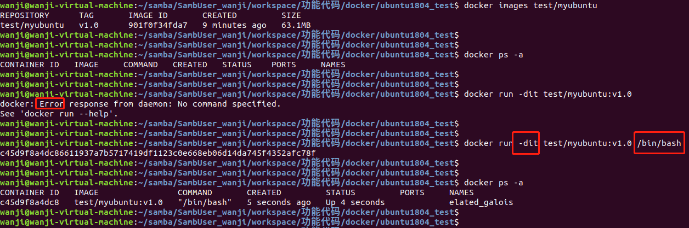


### 5.导出镜像（save）

```
docker save [IMAGE NAME] > [PATH+NAME]
```

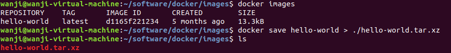


### 6.查询容器（ps）

```
docker ps -a
```

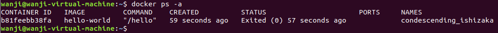


- 不加 -a 参数时，只列出**正在运行的容器**；
- 添加 -a 参数时，列出所有容器，包括**之前运行过的容器**（退出状态）。


### 7.容器控制：start、restart、stop、kill

```
docker start [CONTAINER ID]
docker restart [CONTAINER ID]
docker stop [CONTAINER ID]
docker kill [CONTAINER ID]
```

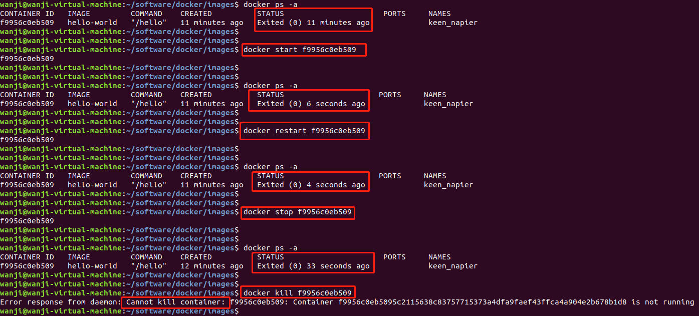


- 注：由于 [hello-world] 镜像运行后就自动退出了，所以容器状态一直是退出状态（exit）；
- 但是我们仍然可以从退出时间看出 start、restart、stop、kill 这几条命令的作用；
- kill 指令只能对正在运行的容器进行操作；


### 8.删除容器（rm、prune）

```
docker rm [CONTAINER ID]
//或者
docker container rm [CONTAINER ID]

//用下面的命令可以清理掉所有处于终止状态的容器
docker container prune
```

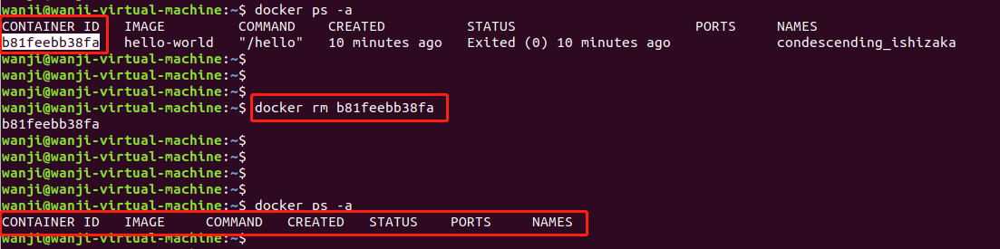

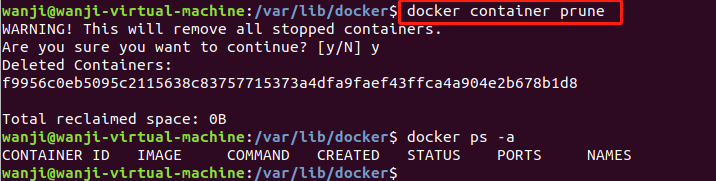


### 9.删除镜像（rmi）

```
docker rmi [REPOSITIRY/IMAGE ID]
或者：
docker image rm [REPOSITIRY/IMAGE ID]
```

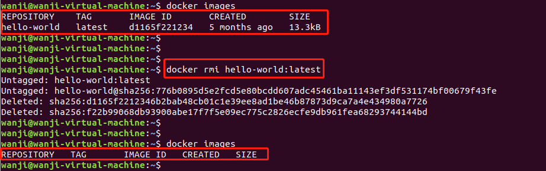


- 注：删除镜像之前，需要**先删除镜像对应的容器**；或者**加 '-f' 参数强制删除**。


### 10.导入镜像（load）

```
docker load < [PATH+NAME]
```

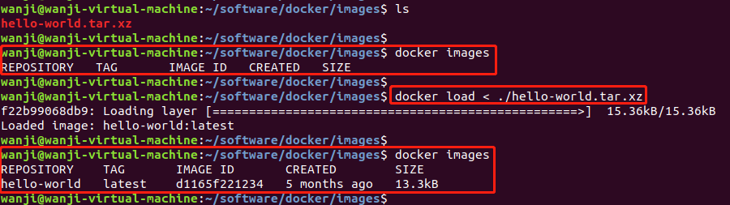


## 三、其他指令

### 1.进入容器（attach、exec）

- 当我们执行 run 指令，并使用了 -d 参数时，容器启动后会进入后台；
- 这时如果我们又需要进入容器进行操作，就会用到 **docker attach** 命令或 **docker exec** 命令；
- 通过这两个命令都可以进入容器，但是**推荐使用 docker exec 命令**，因为从终端 exit 退出后，exec 不会导致容器的停止，而 attach 会导致容器直接停止；
- 具体现象参考下面示例：

#### 1.1 attach

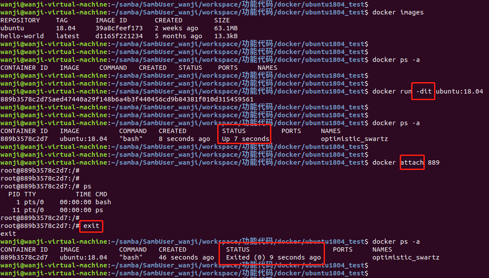

- 从上面示例可以看出：如果使用 attach 进入终端，则从 stdin 中 exit 后，会导致容器的停止。

#### 1.2 exec

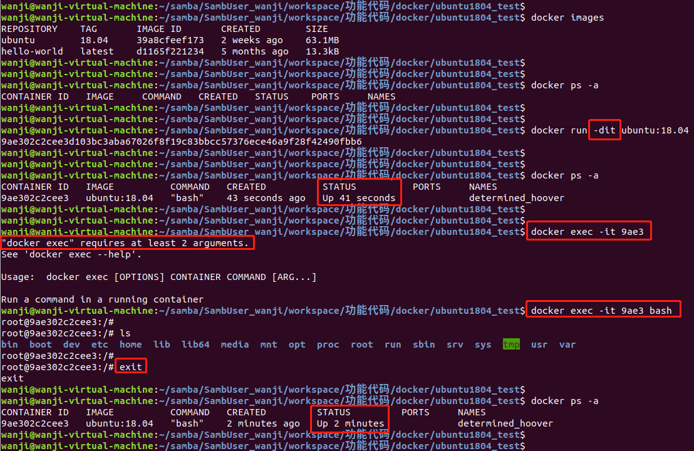

- docker exec 后边可以跟多个参数，这里主要说明 -i -t 这两个参数：
  - -i		：交互式操作，即返回命令执行结果；
  - -t		：分配伪终端；
  - 当 -i -t 参数一起使用时，则可以看到我们熟悉的 Linux 命令提示符。
- exec 指令与 attach 不同的一点是，它至少需要加两个参数，想要进入容器，**需要添加 “bash”**。
- 
  从上面示例可以看出：如果使用 exec 进入终端，则从 stdin 中 exit 后，不会导致容器的停止，这也是推荐使用 docker exec 的原因。


### 2.导出容器（export）

- 可以使用 docker export 命令将**容器快照导出到本地**，如下：

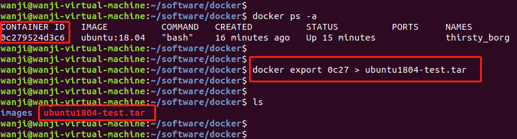

- 注意与 save 指令的区别：
  - docker save 是**将指定镜像保存成  tar 归档文件**；
  - docker export 是**将指定容器快照保存成 tar 归档文件**；
  - 使用 export 导出为容器快照文件将**丢弃所有的历史记录和元数据信息**（即仅保存容器当时的快照状态）；而使用 save 导出镜像存储文件将保存完整记录，因此体积也要更大。


### 3.导入容器快照（import）

- 可以使用 docker import 命令**将容器快照文件再导入为镜像**，如下：

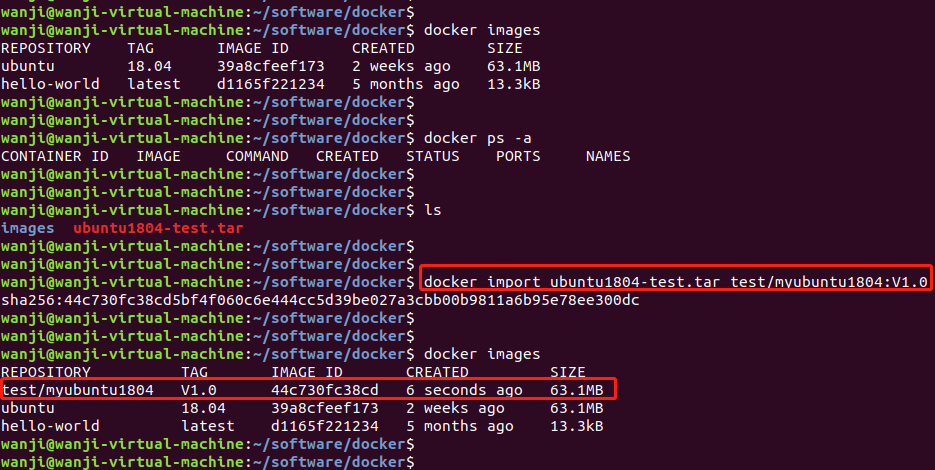

- 示例中命令含义为：从镜像归档文件 ubuntu1804-test.tar 创建镜像，并命名为 test/myubuntu1804:V1.0 。
- 注意与 load 指令的区别：
  - import 指令只能将使用 export 指令生成的归档文件再导入为镜像；
  - load 指令只能将使用 save 指令生成的归档文件再导入为镜像；
  - 使用 import 指令从容器快照文件导入时可以重新指定标签等元数据信息，而 load 指令不可指定。


### 4.从容器创建一个新的镜像（commit）

- 作用：**将容器保存为新的镜像**，并可添加提交人信息和说明信息。
- 语法：**docker commit [OPTIONS] CONTAINER [REPOSITORY[:TAG]]**
  - -a ：提交的镜像作者；
  - -c ：使用 Dockerfile 指令来创建镜像；
  - -m ：提交时的说明文字；
  - -p ：在 commit 时，将容器暂停。
- 示例：将容器 5e7be6d80da6 保存为名字为 test/myubuntu1804:V1.1 的新镜像，并添加提交人信息“sea”，说明信息“Add app folder under root directory”，并且设置在执行 commit 时将容器暂停。

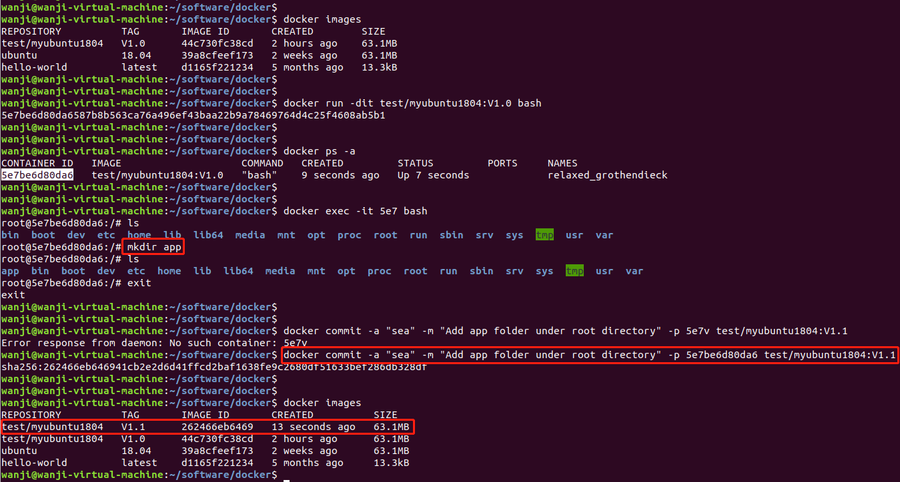


### 5.容器与主机之间的数据拷贝（CP）

- 作用：实现容器与主机之间的数据拷贝。
- 语法：

```
docker cp [OPTIONS] CONTAINER:SRC_PATH 	DEST_PATH
docker cp [OPTIONS] SRC_PATH 			CONTAINER:DEST_PATH

//OPTIONS说明：
-L :保持源目标中的链接
```

- 示例：

  - 将主机当前目录下的 “Dockerfile” 文件拷贝到容器的 /volume_data 目录下：

  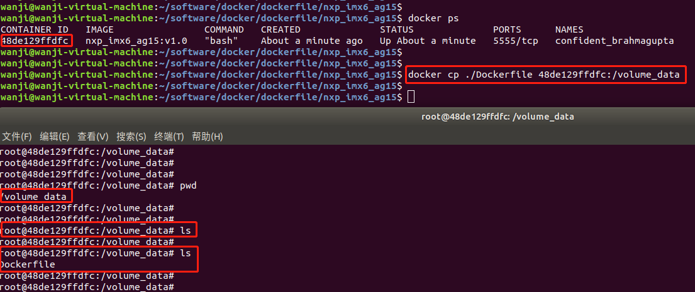

  - 将容器 /volume_data 目录下的 “container.txt” 文件拷贝到主机当前目录下：

  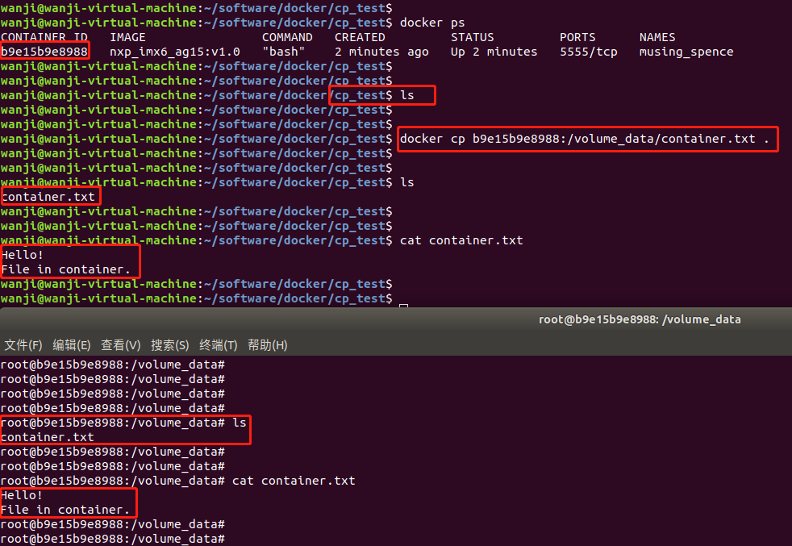


### 6.使用 Dockerfile 创建镜像（build）

- 作用：通过此命令，可以按照编写好的 Dockerfile 文件中的规则生成镜像。

- 语法：**docker build [OPTIONS] PATH | URL | -**

- OPTIONS 说明：

  - **--build-arg=[] :**设置镜像创建时的变量；
  - **--cpu-shares :**设置 cpu 使用权重；
  - **--cpu-period :**限制 CPU CFS周期；
  - **--cpu-quota :**限制 CPU CFS配额；
  - **--cpuset-cpus :**指定使用的CPU id；
  - **--cpuset-mems :**指定使用的内存 id；
  - **--disable-content-trust :**忽略校验，默认开启；
  - **-f :**指定要使用的Dockerfile路径；
  - **--force-rm :**设置镜像过程中删除中间容器；
  - **--isolation :**使用容器隔离技术；
  - **--label=[] :**设置镜像使用的元数据；
  - **-m :**设置内存最大值；
  - **--memory-swap :**设置Swap的最大值为内存+swap，"-1"表示不限swap；
  - **--no-cache :**创建镜像的过程不使用缓存；
  - **--pull :**尝试去更新镜像的新版本；
  - **--quiet, -q :**安静模式，成功后只输出镜像 ID；
  - **--rm :**设置镜像成功后删除中间容器；
  - **--shm-size :**设置/dev/shm的大小，默认值是64M；
  - **--ulimit :**Ulimit配置。
  - **--squash :**将 Dockerfile 中所有的操作压缩为一层。
  - **--tag, -t:** 镜像的名字及标签，通常 name:tag 或者 name 格式；可以在一次构建中为一个镜像设置多个标签。
  - **--network:** 默认 default。在构建期间设置RUN指令的网络模式

- 示例：

  - 使用当前目录的 Dockerfile 创建镜像，标签为 runoob/ubuntu:v1 ：

  ```
  docker build -t runoob/ubuntu:v1 . 
  ```

  - 使用URL **github.com/creack/docker-firefox** 的 Dockerfile 创建镜像：

  ```
  docker build github.com/creack/docker-firefox
  ```

  - 通过 -f 参数指定 Dockerfile 文件的位置：

  ```
  docker build -f /path/to/a/Dockerfile .
  ```

- 注意：在执行 Dockerfile 中的指令前，首先会对 Dockerfile 进行语法检查，有语法错误时会返回：

```
docker build -t test/myapp .
Sending build context to Docker daemon 2.048 kB
Error response from daemon: Unknown instruction: RUNCMD
```


## 四、参考链接

- [Install Docker Engine on Ubuntu](https://docs.docker.com/engine/install/ubuntu/)
- [Ubuntu下docker的安装](https://blog.csdn.net/qq_40423339/article/details/87885086)
- [在Ubuntu中安装Docker和docker的使用](https://www.cnblogs.com/blog-rui/p/11244023.html)
- [Docker 命令大全](https://www.runoob.com/docker/docker-command-manual.html)


