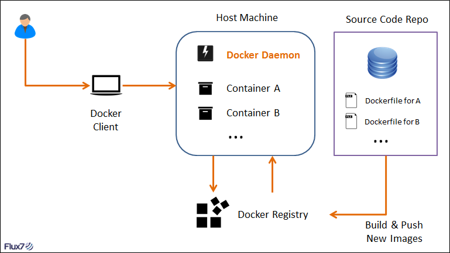

# Dockerfile的使用

## 一、Dockerfile简介

### 1.Dockerfile是什么

- Dockerfile 是**自动构建 Docker 镜像的配置文件**，用户可以使用 Dockerfile 快速**创建自定义的镜像**。
- 在实际使用中，我们可以使用 Dockerfile 创建一个镜像，然后依赖这个镜像来运行容器，可见 **Dockerfile 是镜像和容器的关键**，从下图可以更直观地感受 **镜像、容器和 Dockerfile** 三者之间的关系：



- 从上图我们可以看到，Dockerfile 可以自定义镜像，然后通过 Docker 命令去运行镜像，从而达到启动容器的目的。
- Dockerfile 是由一行行命令语句组成的，这些**命令非常类似于 Linux 下的 Shell 命令**，并且支持以 '#' 开头的注释行。


### 2.Dockerfile基本结构

- 一般来说，我们可以将 Dockerfile 分为四个部分：
  - **基础镜像信息**：也叫做父镜像，对应 **FROM** 指令；
  - **维护者信息**：对应 **MAINTAINER 或 LABEL** 指令；
  - **镜像操作指令**：如  **RUN** 、**EVN** 、**ADD**、**COPY** 和 **WORKDIR** 等；
  - **容器启动时执行指令**：如  **CMD** 、**ENTRYPOINT** 和 **USER** 等；
- Dockerfile 文件内容简单示例：

```
FROM ubuntu:18.04
LABEL version="1.0" description="test" by="sea" email="fanzhihai@wanji.net.cn"
WORKDIR /app
COPY . /app
RUN echo "Hello docker!!!" >> /app/hello.log
EXPOSE 5555
CMD ["./a.out"]
```

- 示例解释如下：
  - 从 Docker Hub 上 Pull 下ubuntu:18.04 的基础镜像；
  - 为镜像添加元数据：版本、描述、作者、邮箱；
  - 指定工作目录为 /app ；
  - 复制指定路径中的文件到容器中的 /app 目录下**（注意：‘.’ 是上下文路径的相对地址，上下文路径在执行 docker build 指令时设置）**；
  - 构建镜像时执行的命令；
  - 暴露端口：5555；
  - 构建容器后执行的命令；
- 注意：
  - Docker 以从上到下的顺序运行 Dockerfile 中的指令，每一个指令都以 step 为步骤。
  - Dockerfile 文件的命名必须为 Dockerfile 。


## 二、Dockerfile 常用指令

### 1.FROM ：指定基础镜像，是必备指令，且必须为第一个命令

#### <格式>

```
格式：
    FROM <image>
    FROM <image>:<tag>
    FROM <image>@<digest>
示例：
	FROM ubuntu:18.04
说明：
	tag 或 digest 是可选的，如果不使用这两个值时，会使用 latest 版本的基础镜像
```

#### <说明>

- 一个 Dockerfile 中 FROM 是必备的指令，并且必须是第一条指令。
- 在 [Docker Hub](https://hub.docker.com/search?q=&type=image&image_filter=official) 上有非常多高质量的官方镜像，我们可以直接拿来使用：
  - 服务类镜像： [`nginx`](https://hub.docker.com/_/nginx/)、[`redis`](https://hub.docker.com/_/redis/)、[`mongo`](https://hub.docker.com/_/mongo/)、[`mysql`](https://hub.docker.com/_/mysql/)、[`httpd`](https://hub.docker.com/_/httpd/)、[`php`](https://hub.docker.com/_/php/)、[`tomcat`](https://hub.docker.com/_/tomcat/) 等；
  - 方便开发、构建、运行各种语言应用的镜像： [`node`](https://hub.docker.com/_/node)、[`openjdk`](https://hub.docker.com/_/openjdk/)、[`python`](https://hub.docker.com/_/python/)、[`ruby`](https://hub.docker.com/_/ruby/)、[`golang`](https://hub.docker.com/_/golang/) 等；
  - 更为基础的操作系统镜像： [`ubuntu`](https://hub.docker.com/_/ubuntu/)、[`debian`](https://hub.docker.com/_/debian/)、[`centos`](https://hub.docker.com/_/centos/)、[`fedora`](https://hub.docker.com/_/fedora/)、[`alpine`](https://hub.docker.com/_/alpine/) 等；

- 除了选择现有镜像为基础镜像外，Docker 还存在一个特殊的镜像，名为 **scratch**。
  - 这个镜像是虚拟的概念，并不实际存在，它**表示一个空白的镜像**。
  - 如果以 scratch 为基础镜像的话，意味着**不以任何镜像为基础**，接下来所写的指令将作为镜像第一层开始存在，使用 [Go 语言](https://golang.google.cn/) 开发的应用很多会使用这种方式来制作镜像。


### 2.MAINTAINER：声明维护者信息，命令已经过期，推荐使用 LABEL

#### <格式>

```
格式：
    MAINTAINER <name>
示例：
    MAINTAINER Jasper Xu
    MAINTAINER sorex@163.com
    MAINTAINER Jasper Xu <sorex@163.com>
```


### 3.LABEL：为镜像添加元数据，多用于声明构建信息、作者、机构、组织等

#### <格式>

```
格式：
    LABEL <key>=<value> <key>=<value> <key>=<value> ...
示例：
    LABEL version="1.0" description="test" by="sea" email="fanzhihai@wanji.net.cn"
```

#### <说明>

- 使用 LABEL 指定元数据时，一条 LABEL **可以指定一或多条元数据**，以**“key=value”对**的形式体现；
- 指定多条元数据时，**不同元数据之间通过空格分隔**。
- 推荐**将所有的元数据通过一条 LABEL 指令指定**，以免生成过多的中间镜像。


### 4.WORKDIR：指定工作目录，类似于我们通常使用的 cd 命令

#### <格式>

```
格式：
    WORKDIR <PATH>
示例：
    WORKDIR /a  	# 这时工作目录为/a
    WORKDIR b  		# 这时工作目录为/a/b
    WORKDIR c  		# 这时工作目录为/a/b/c
```

#### <说明>

- 不使用 WORKDIR 设置工作路径时，**默认路径为 /** 。
- WORKDIR **可以设置多次**，如果是相对路径，则相对前一个 WORKDIR 命令，参考上面的示例。
- 通过 WORKDIR 设置工作目录后，Dockerfile 中其后的命令 RUN、CMD、ENTRYPOINT、ADD、COPY等都会在该目录下执行。
- 在使用 docker run 运行容器时，可以通过 **-w 参数覆盖构建时所设置的工作目录**。


### 5.COPY：将本地文件复制到容器中

#### <格式>

```
格式：
    COPY [--chown=<user>:<group>] <src>... <dest>
    COPY [--chown=<user>:<group>] ["<src>",... "<dest>"]	# 用于支持包含空格的路径
示例：
    COPY . /app
```

#### <说明>

- COPY 指令将**从构建上下文目录中 <源路径> 的文件/目录**复制到**新的一层的镜像内的 <目标路径> 位置**。
-  <源路径> 可以是多个，甚至可以是通配符，其通配符规则要满足 Go 的 [`filepath.Match`](https://golang.org/pkg/path/filepath/#Match) 规则。
- <目标路径>可以是容器内的绝对路径，也可以是相对于工作目录（用 WORKDIR 指定）的相对路径。
- 使用 COPY 指令时，**源文件的各种元数据都会保留**，比如读、写、执行权限、文件变更时间等。
  - 这个特性对于镜像定制很有用，特别是构建相关文件都在使用 Git 进行管理的时候。
- 在使用该指令的时候还可以加上  --chown=<user>:<group> 选项来**改变文件的所属用户及所属组**。
- 如果源路径为文件夹，复制的时候**不是直接复制该文件夹**，而是**将文件夹中的内容复制到目标路径**。


### 6.ADD：更高级的复制文件

#### <格式>

```
格式：
    ADD [--chown=<user>:<group>] <src>... <dest>
    ADD [--chown=<user>:<group>] ["<src>",... "<dest>"]	# 用于支持包含空格的路径
示例：
    ADD hom* /mydir/          # 添加所有以"hom"开头的文件到镜像的/mydir/路径下
    ADD hom?.txt /mydir/      # ? 替代一个单字符,例如："home.txt"
    ADD test relativeDir/     # 添加 "test" 到 `WORKDIR`/relativeDir/
    ADD test /absoluteDir/    # 添加 "test" 到 /absoluteDir/
```

#### <说明>

- ADD 指令和 COPY 的格式和性质基本一致，但是在 COPY 基础上增加了一些功能：
  -  <源路径> 可以是一个 URL，即 ADD 指令**可以访问网络资源**，类似 wget。这种情况下，Docker 引擎会试图去下载这个链接的文件放到 <目标路径>去 ；
  - 如果 <源路径> 为一个 tar 压缩文件的话，压缩格式为 gzip，bzip2 以及 xz 的情况下，ADD 指令将会**自动解压缩**这个压缩文件到 <目标路径> 去（URL 下载的网络压缩资源不会被解压）。
- 官方推荐：所有的**文件复制均使用 COPY 指令**，**仅在需要自动解压缩的场合使用 ADD**。


### 7.RUN：容器内部执行命令

#### <格式>

```
格式：
    RUN <command>								# shell执行
    RUN ["executable", "param1", "param2"]		# exec执行
示例：
    RUN apt-get update
    RUN ["/etc/execfile", "arg1", "arg1"]
```

#### <说明>

- RUN 指令创建的中间镜像会被缓存，并会在下次构建中使用。如果不想使用这些缓存镜像，可以在构建时指定 **--no-cache** 参数，如：docker build --no-cache 
- 注意：每执行一次 RUN 指令，就会创建一层镜像，所以相关操作要放到一个 RUN 指令中执行，**切不可像 shell 脚本那样每个操作都调用一次 RUN 指令**，我们可以使用 “&&” 将各个所需命令串联起来。


### 8.EVN：设置环境变量

#### <格式>

```
格式：
    ENV <key> <value>  		#格式一
    ENV <key>=<value> ...  	#格式二
    
示例：
    ENV myName John Doe
    ENV myDog Rex The Dog
    ENV myCat=fluffy myDog=Rex
```

#### <说明>

- 格式一中，<key>之后的所有内容均会被视为其<value>的组成部分，因此，一次只能设置一个变量。
- 格式二中，可以设置多个变量，每个变量为一个"<key>=<value>"的键值对，如果<key>中包含空格，可以使用 \ 来进行转义，也可以通过 "" 来进行标示；另外，反斜线也可以用于续行。
- 可以通过 ${key} 在其它指令中来引用变量，如 ${myDog} 。我们也可以通过 docker run 中的 -e <ENV> 来动态赋值。


### 9.CMD：启动容器时默认执行的命令（可包含可执行文件）

#### <格式>

```
格式：
    CMD ["executable","param1","param2"]	# 格式一：推荐使用的 exec 形式
    CMD ["param1","param2"]					# 格式二：无可执行程序形式
    CMD command param1 param2				# 格式三：Shell 形式

示例：
    CMD echo "This is a test." | wc -
    CMD ["/usr/bin/wc","--help"]
    CMD ["ls","-al"]
```

#### <说明>

- CMD 不同于 RUN：
  - CMD 用于指定在**容器启动时**所要执行的命令，而 RUN 用于指定**镜像构建时**所要执行的命令。
  - 一个 Dockerfile 中**只能有一个 CMD，如果有多个，则最后一个生效**；但可以有多个 RUN 命令。
- 对于格式二，即不包含可执行文件的情况，需要用 **ENTRYPOINT** 指定一个可执行文件，然后 CMD 命令的参数（param1、param2）就会作为 ENTRYPOINT 的参数。
- 对于格式三，即 shell 形式的情况，默认调用 /bin/sh -c 执行命令。
- **CMD 命令会被 Docker 命令行传入的参数覆盖**，如：docker run busybox /bin/echo Hello Docker 命令，会把 CMD 里的命令覆盖。


### 10.ENTRYPOINT：配置容器，使其可执行化

#### <格式>

```
格式：
    ENTRYPOINT ["executable", "param1", "param2"]	# 格式一：可执行文件, 优先
    ENTRYPOINT command param1 param2				# 格式二：shell内部命令

示例：
    FROM ubuntu
    ENTRYPOINT ["top", "-b"]
    CMD ["-c"]
```

#### <说明>

- 如 CMD 指令中所说，使用 ENTRYPOINT 指定可执行文件后，CMD 指令中即可省去可执行文件，而只指定可执行文件的参数即可，且此时 CMD 指令指定的参数会附加到 ENTRYPOINT 指令中。
- ENTRYPOINT 与 CMD 非常类似，二者异同点如下：
  - 与 CMD 指令不同，**通过 docker run 执行的命令不会覆盖 ENTRYPOINT**，而 docker run 命令中指定的任何参数，都会被当做参数再次传递给 ENTRYPOINT。
  - 与 CMD 相同，Dockerfile 中**也只允许有一个 ENTRYPOINT命令**，多指定时会覆盖前面的设置，而只执行最后的 ENTRYPOINT 指令。

- 关于 ENTRYPOINT 具体的应用场景，参考下面文章：
  - [Dockerfile 指令之 ENTRYPOINT](https://yeasy.gitbook.io/docker_practice/image/dockerfile/entrypoint)


### 11.EXPOSE：指定与外界交互的端口

#### <格式>

```
格式：
    EXPOSE <port> [<port>...]
    
示例：
    EXPOSE 80 443
    EXPOSE 8080
    EXPOSE 11211/tcp 11211/udp
```

#### <说明>

- **EXPOSE 并不会让容器的端口访问到主机**。要使其可访问，需要在 docker run 运行容器时通过 **-p** 来发布这些端口，或通过 **-P** 参数来发布 EXPOSE 导出的所有端口。


### 12.VOLUME：定义匿名数据卷

#### <格式>

```
格式：
    VOLUME ["/path/to/dir"]

示例：
    VOLUME ["/data"]
    VOLUME ["/var/www", "/var/log/apache2", "/etc/apache2"]
```

#### <说明>

- 容器运行时应该尽量保持容器存储层不发生写操作，**对于数据库类需要保存动态数据的应用，其数据库文件应该保存于卷（volume）中**，卷的作用如下：
  - 避免重要的数据，因容器重启而丢失，这是非常致命的；
  - 避免容器不断变大；
- 为了防止运行时用户忘记将动态文件所保存目录挂载为卷，在 `Dockerfile` 中，我们可以**事先指定某些目录挂载为匿名卷**，这样在运行时如果用户不指定挂载，其应用也可以正常运行，不会向容器存储层写入大量数据。
- 示例中的 `/data` 目录就会在容器运行时自动挂载为匿名卷，任何向 `/data` 中写入的信息都不会记录进容器存储层，从而**保证了容器存储层的无状态化**。当然，运行容器时可以通过 -v 参数覆盖这个挂载设置：

```
$ docker run -d -v mydata:/data [image]

# 在这行命令中，就使用了 mydata 这个命名卷挂载到了 /data 这个位置，替代了 Dockerfile 中定义的匿名卷的挂载配置。
```

- 一个卷可以存在于一个或多个容器的指定目录，该目录可以绕过联合文件系统，并具有以下功能：
  - 卷可以容器间共享和重用；
  - 容器并不一定要和其它容器共享卷；
  - 修改卷后会立即生效；
  - 对卷的修改不会对镜像产生影响；
  - 卷会一直存在，直到没有任何容器在使用它；


### 13.USER：指定执行后续命令的用户和用户组（必须提前已经存在）

#### <格式>

```
格式:
    USER user			# 用户名
    USER user:group		# 用户名：用户组
    USER uid			# UID
    USER uid:gid		# UID：GID
    USER user:gid		# 用户名：GID
    USER uid:group		# UID：用户组

示例：
    RUN groupadd -r wanji && useradd -r -g wanji wanji
    USER wanji
    ...
```

#### <说明>

- `USER` 指令和 `WORKDIR` 相似，都是**改变环境状态并影响以后的层**。`WORKDIR` 是改变工作目录，`USER` 则是改变之后层的执行 `RUN`, `CMD` 以及 `ENTRYPOINT` 这类命令的身份，这些指令都将以此用户的身份被执行。
- 注意，`USER` 只是帮助你**切换到指定用户**而已，**这个用户必须是事先建立好的，否则无法切换**。
- 镜像构建完成后，通过 docker run 运行容器时，可以通过 **-u** 参数来覆盖所指定的用户。


### 14.ARG：构建参数

#### <格式>

```
格式:
    ARG <参数名>[=<默认值>]

示例：
    ARG DOCKER_USERNAME=library				# 只在 FROM 中生效
    FROM ${DOCKER_USERNAME}/alpine
    ARG DOCKER_USERNAME=library				# 要想在 FROM 之后使用，必须再次指定
    RUN set -x ; echo ${DOCKER_USERNAME}
```

#### <说明>

- 构建参数 `ARG` 和 `ENV` 的效果一样，都是**设置环境变量**。所不同的是：
  - `ARG` 所**设置的是构建环境的环境变量（即dockerfile文件中的全局变量）**，在将来**容器运行时是不会存在这些环境变量的**。但是不要因此就使用 `ARG` 保存密码之类的信息，因为 `docker history` 还是可以看到所有值的。
  - 而 `ENV` 用于**设置容器的环境变量**。

- `Dockerfile` 中的 `ARG` 指令用来定义参数名称以及其默认值。该默认值可以在构建命令 `docker build` 中用 `--build-arg <参数名>=<值>` 来覆盖。
- **灵活的使用 `ARG` 指令，能够在不修改 Dockerfile 的情况下，构建出不同的镜像**。
- 但需注意，ARG 指令有生效范围，**如果在 `FROM` 指令之前指定，那么只能用于 `FROM` 指令中**；**要想在 FROM 之后继续使用，需要重新指定**，如示例中所示；对于多阶段构建，尤其要注意这个问题。


## 三、示例

```
# Environment for NXP-IMX6-AG15

# 基础镜像
FROM nxp_imx6_ag15:base

# 镜像元数据
LABEL version="1.0" description="Environment for NXP-IMX6-AG15" by="sea" email="fanzhihai@wanji.net.cn"

# 指定对外端口
EXPOSE 5555

# 指定匿名数据卷
VOLUME ["/volume_data"]

# 设置工作目录
ARG USER_WORKDIR=/home/wanji/app
WORKDIR ${USER_WORKDIR}

# 拷贝本地文件到容器指定目录
# COPY ./ETC_ENHANCE ${USER_WORKDIR}/ETC_ENHANCE

# 容器执行命令
# RUN     . /opt/fslc-framebuffer/2.4.4/environment-setup-armv7at2hf-neon-fslc-linux-gnueabi \
#    &&  cd ${USER_WORKDIR}/ETC_ENHANCE/V2X_APP_AG15_ETC_ENHANCE/build/ \
#    &&  cmake .. \
#    &&  make

# 创建并指定用户
# RUN groupadd -r -f wanji && useradd -r -g wanji wanji
# USER wanji

# 启动容器时默认执行的命令
# CMD ["ls", "-al"]

```


## 四、执行 Dockerfile 文件（docker build）

- 在完成 Dockerfile 文件的编写后，我们需要使用 **docker build** 指令来执行 Dockerfile 文件。

- 通过此命令，可以按照编写好的 Dockerfile 文件中的规则生成镜像。

- 语法：**docker build [OPTIONS] PATH | URL | -**

- [option] 说明：

  - **--build-arg=[] :**设置镜像创建时的变量；
  - **--cpu-shares :**设置 cpu 使用权重；
  - **--cpu-period :**限制 CPU CFS周期；
  - **--cpu-quota :**限制 CPU CFS配额；
  - **--cpuset-cpus :**指定使用的CPU id；
  - **--cpuset-mems :**指定使用的内存 id；
  - **--disable-content-trust :**忽略校验，默认开启；
  - **-f :**指定要使用的Dockerfile路径；
  - **--force-rm :**设置镜像过程中删除中间容器；
  - **--isolation :**使用容器隔离技术；
  - **--label=[] :**设置镜像使用的元数据；
  - **-m :**设置内存最大值；
  - **--memory-swap :**设置Swap的最大值为内存+swap，"-1"表示不限swap；
  - **--no-cache :**创建镜像的过程不使用缓存；
  - **--pull :**尝试去更新镜像的新版本；
  - **--quiet, -q :**安静模式，成功后只输出镜像 ID；
  - **--rm :**设置镜像成功后删除中间容器；
  - **--shm-size :**设置/dev/shm的大小，默认值是64M；
  - **--ulimit :**Ulimit配置。
  - **--squash :**将 Dockerfile 中所有的操作压缩为一层。
  - **--tag, -t:** 镜像的名字及标签，通常 name:tag 或者 name 格式；可以在一次构建中为一个镜像设置多个标签。
  - **--network:** 默认 default。在构建期间设置RUN指令的网络模式；

- 示例：

  - 使用当前目录的 Dockerfile 创建镜像，标签为 runoob/ubuntu:v1 ：

  ```
  docker build -t runoob/ubuntu:v1 . 
  ```

  - 使用URL **github.com/creack/docker-firefox** 的 Dockerfile 创建镜像：

  ```
  docker build github.com/creack/docker-firefox
  ```

  - 通过 -f 参数指定 Dockerfile 文件的位置：

  ```
  docker build -f /path/to/a/Dockerfile .
  ```

- 注意：

  - 需要在 Dockerfile 目录下执行 docker build 命令，或者使用 -f 参数指定 Dockerfile 目录；
  - 在执行 Dockerfile 中的指令前，首先会对 Dockerfile 进行语法检查，有语法错误时会返回：

```
docker build -t test/myapp .
Sending build context to Docker daemon 2.048 kB
Error response from daemon: Unknown instruction: RUNCMD
```


## 五、参考链接

- [Docker 从入门到实践](https://yeasy.gitbook.io/docker_practice/)
- [这可能是最为详细的Docker入门总结](http://dockone.io/article/8350)
- [Dockerfile文件详解](https://www.cnblogs.com/panwenbin-logs/p/8007348.html)


