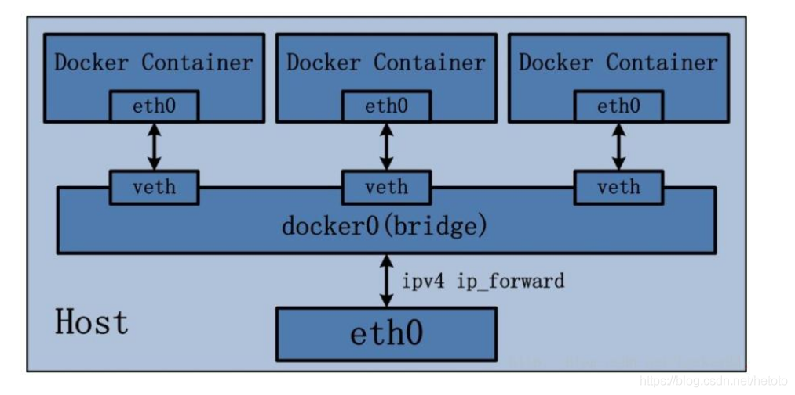

# Docker网络配置

## 一、docker 的网络模式

### 1. docker 安装后会自动创建三种网络：bridge、host、none

### 2. docker 在启动时会开启一个虚拟网桥设备docker0

- docker0 默认的地址为 **172.17.0.1/16** ；
- 容器启动后都会被桥接到 docker0 上，并自动分配到一个 ip 地址，且地址逐渐递增；

## 二、容器的四种网络模式

### 1. bridge 模式

- 启动容器时，默认使用 bridge 模式；
- 该模式下 Docker Container 不具有一个公有 IP，即和宿主机的 eth0（ens33） 不处于同一个网段；
- 这导致只有宿主机可以直接和容器进行通信，外部主机是不可见的；
- 但容器通过宿主机的 NAT 规则，可以使容器访问外网；
- 但是 NAT 模式仍然存在问题与不便，如：
  - 容器均需要在宿主机上竞争端口；
  - 容器内部服务的访问者需要使用服务发现获知服务的外部端口；
  - 另外 NAT 模式由于是在三层网络上的实现手段，故肯定会影响网络的传输效率。

### 2. host 模式

- host 网络模式需要在容器创建时（docker run）添加参数 **--network=host** ；
- host 模式是 bridge 桥接模式很好的补充：
  - 采用 host 模式的容器，可以共享宿主机网络栈，直接使用宿主机的 IP 地址与外界进行通信；
  - 若宿主机的 eth0（ens33） 是一个公有 IP，那么容器也拥有这个公有IP；
  - 同时容器内服务的端口也可以使用宿主机的端口，无需额外进行 NAT 转换。

- host 模式也有自身的缺点：
  - 最明显的是容器的网络环境隔离性被弱化，即容器不再拥有隔离、独立的网络栈；
  - 使用 host 模式的容器虽然可以让容器内部的服务和传统情况无差别、无改造的使用，但是由于网络隔离性的弱化，该容器会与宿主机共享竞争网络栈的使用；
  - 另外，容器内部将不再拥有所有的端口资源，原因是部分端口资源已经被宿主机本身的服务占用，还有部分端口已经用以 bridge 网络模式容器的端口映射；

### 3.  none 模式

- none 模式是指**禁用网络功能**，**只有 lo 接口**，在容器创建时使用 **--network=none** 指定；
- 一旦 docker 容器采用了 none 网络模式，那么容器内部就只能使用 loopback 网络设备，不会再有其他的网络资源。
- 可以说 none 模式为 docker 容器做了极少的网络设定，但是俗话说得好“少即是多”，在没有网络配置的情况下，作为 Docker 开发者，才能在这基础上做其他无限多可能的网络定制开发，这也恰巧体现了 Docker 设计理念的开放。

### 4. Container 模式

- Container 网络模式是 Docker 中一种较为特别的网络的模式，在容器创建时需要使用如下参数进行指定：
  -  **--network=container:vm1** （vm1指定的是运行的容器名）

- 处于这个模式下的 Docker 容器会共享一个网络栈，这样两个容器之间可以使用 localhost 高效快速通信：

- 但是 Container 模式并没有改善容器与宿主机以外世界通信的情况，即与桥接模式一样，不能连接宿主机以外的其他设备；

- 注意：
  - 使用 Container 模式时，**不能通过 --hostname 参数指定主机名称**，否则会发生冲突而报错（见上图）

## 三、使用 --link 实现容器间的相互通信

- docker run --link 可以用来链接两个容器，使得源容器（被链接的容器）和接收容器（主动去链接的容器）之间可以互相通信，并且接收容器可以获取源容器的一些数据，如源容器的环境变量等；
- 当不使用 --link 参数时，无法通过容器名通信（但可以ping通IP）：

- 当使用 --link 参数时，可以使用容器名进行通信（其中 d1 是指定的别名）：

## 四、高级网络配置

### 1.三种自定义网络驱动

- 在自定义网络模式中，docker 提供了三种自定义网络驱动：**bridge**，**overlay**，**macvlan**；
- bridge 自定义网络驱动类似默认的 bridge 网络模式，但增加了一些新的功能；
- overlay 和 macvlan 是用于创建跨主机网络的；
- **建议使用自定义的网络来控制哪些容器可以相互通信**，还可以自动DNS解析容器名称到IP地址；

### 2.bridge（网桥）

#### <1>创建自定义网桥（两种格式）并查看（docker network create/ls）

#### <2>查看自定义网桥的 IP 地址、子网掩码、网关地址（docker network inspect）

#### <3>相同网桥之间的容器均可以互相通信

#### <4>不同网桥之间的容器不能直接通信

#### <5>自定义网段（--subnet 、--gateway）

- 我们在创建网桥的时候，还可以通过 --subnet、--gateway 这两个参数来自定义网段；

#### <6>自定义容器IP地址（--ip）

- 使用 **--ip** 参数可以指定容器的 IP 地址，但此特性必须用在自定义网桥上，其他模式不支持；
- 并且在自定义 IP 地址时，要注意应该与所用自定义网桥的网段相同，否则会报错：

#### <7>实现不同网桥之间容器的相互通信（docker network connect）

- 由<4>知识点可知，连接到不同网桥上的容器之间是不能直接通信的；
- 若想实现不同网桥间容器的通信，需要使用 docker network connect 来设定，格式如下：
  - docker network connect [要额外连接的网桥] [要把新网桥连接到的容器]

### 3.Docker跨主机通讯

